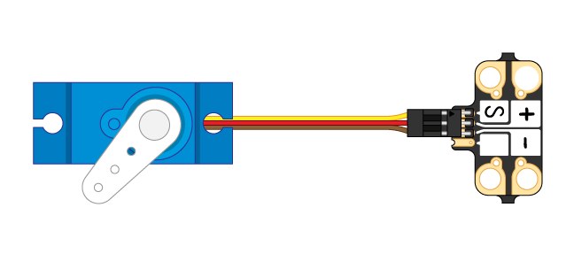
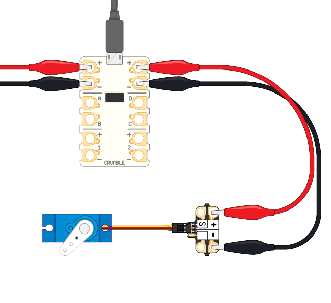
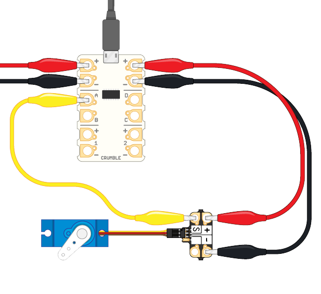

Crumblisers are small, affordable circuit boards that make it easy to connect electronic components to a Crumble using crocodile clips. That means Crumblisers are great for securely connecting servo motor plugs with the Crumble's crocodile clip-friendly terminals.

Crumblisers are made by the makers of the Crumble: Redfern Electronics. You can buy Crumblisers without any male pins or female sockets, or with pre-soldered pins ready to take a servo connector.

### How to use a Crumbliser with a servo motor

- First, connect the servo motor plug to the Crumbliser.

**Important!** Make sure that:

1. The plug's negative cable (black or brown) connects with the terminal marked negative **-** on the Crumbliser
1. The signal cable (usually orange or white) lines up with the terminal marked **S** on the Crumbliser

- Use a crocodile clip cable to connect the Crumbliser's positive **+** terminal to the Crumble's positive **+** terminal.

- Use another crocodile clip cable to connect Crumbliser's negative **-** terminal to the Crumble's positive **-** terminal.

- Choose which terminal (A, B, C, or D) of the Crumble you want to use to control the servo motor.

- Use a crocodile clip cable to connect the chosen terminal to the Crumbliser's **S** terminal.

