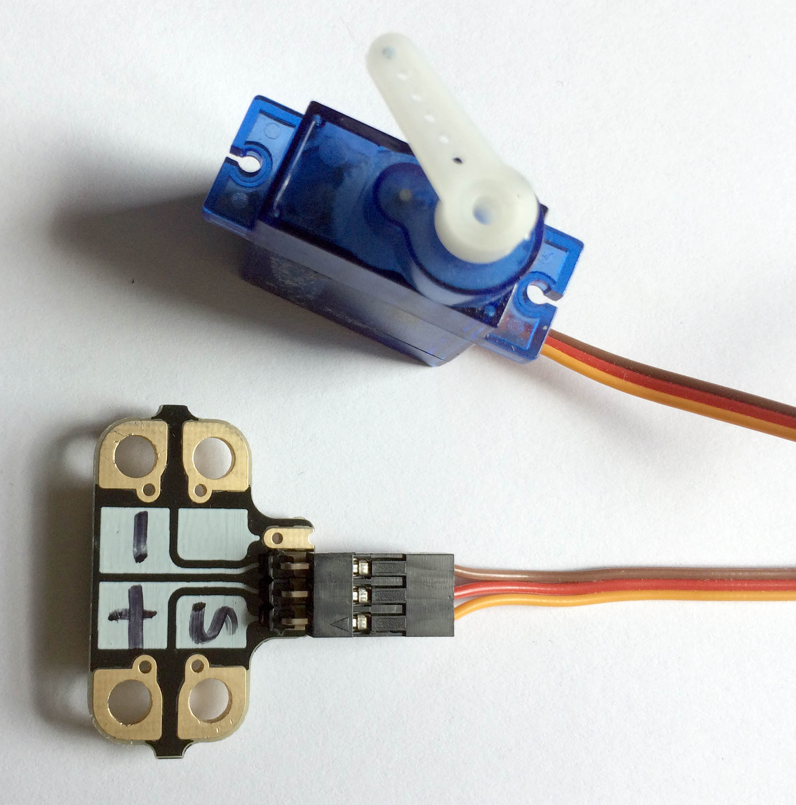
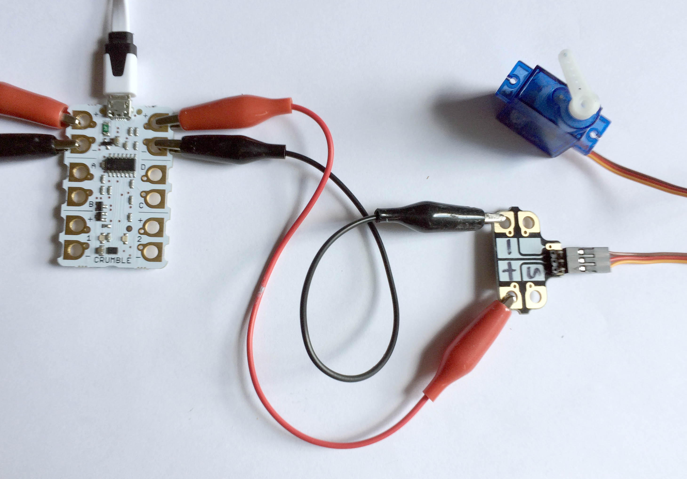

Crumblisers are small, simple circuit boards made by the makers of the Crumble, Redfern Electronics, to help make electrical components easy to connect to a Crumble using crocodile clips. The idea is to convert connectors like the standard servo connector and small jumper pins to crocodile friendly connections.

Crumblisers can be bought without any male pins or female sockets but Redfern Electronics are also happy to provide you with pre-soldered pins ready to take a servo connector.

Crumblisers are cheap and are a great adapter solution for connecting between servo plugs and the Crumble's crocodile friendly terminals.

Plug the servo into the Crumbliser making sure that the negative wire (black or brown) connects with the terminal marked negative (-) on the Crumbliser. The signal wire (usually orange or white) should be lined up with the terminal marked 'S' for signal.

Next, connect a crocodile clip between the positive terminal (+) of the Crumbliser and the positive terminal (+) of the Crumble, and from the negative terminal (-) of the Crumbliser to the negative terminal (-) of the Crumble.

Finally, choose which terminal, A, B, C or D, of the Crumble you want to use to control the servo. Connect a crocodile clip between that terminal and the 'S' terminal of the Crumbliser.

That's it. You're ready to start coding.